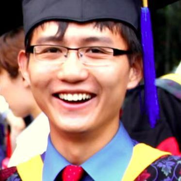
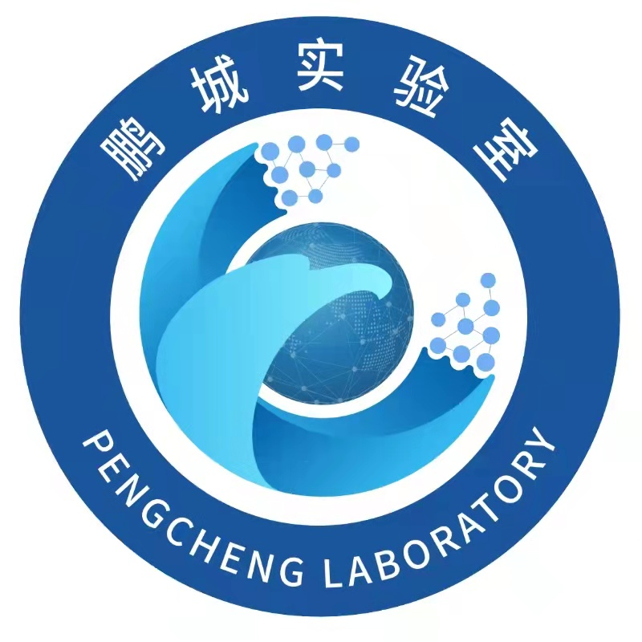

## 🧑‍🤝‍🧑 OpemHAIV Authors

### ⭐ Corresponding Author
- **Xiang Xiang**

{ width="120" }

[Google Scholar](https://scholar.google.com/citations?hl=zh-CN&user=-D5k5ioAAAAJ) | [Homepage](https://eglxiang.github.io/) | ✉️ Email: xex@hust.edu.cn

Xiang Xiang is currently an **associate professor** of Intelligence Science and Technology at {width="18" style="vertical-align:middle;"}  **Huazhong University of Science and Technology**, *Wuhan, China*, where he founds and directs the **HUST AIA Image and Vision Learning Lab (HAIV Lab)** since *2021*, working on **computer vision** and **open-world learning**. 

He is a senior member of {width="18" style="vertical-align:middle;"}  **China Society of Image and Graphics (CSIG)**, and also visiting with {width="18" style="vertical-align:middle;"}  **Peng Cheng Laborotory**, *Shenzhen, China*. 

He has heavily published papers at venues such as **CVPR, ICCV, ECCV, ICML, ACM Multimedia, MICCAI**, etc., and been honorably mentioned twice for the **AI 2000 Most Influential Scholar Award** in recognition of outstanding and vibrant contributions in the field of multimedia in the past decade. 

He has been an applied scientist at {width="18" style="vertical-align:middle;"}  **AWS AI Labs**, *Seattle, USA*, since *2018*, until moving to {width="18" style="vertical-align:middle;"}  **TuSimple**, *San Diego, USA*, as a senior research scientist in *2020*. 

Before that, he received the B.S. degree from {width="18" style="vertical-align:middle;"}  **Wuhan University**, *Wuhan, China*, in *2009*, the M.S. degree from {width="18" style="vertical-align:middle;"}  **Institute of Computing Technology, Chinese Academy of Sciences**, *Beijing, China*, in *2012*, the M.S.E. and Ph.D. degrees from {width="18" style="vertical-align:middle;"}  **Johns Hopkins University**, *Baltimore, USA*, in *2014* and *2018*, respectively, all in computer science.

---

###  🤗 Other Authors
- **Zhou Qinhao**

Zhou Qinhao received his B.S. degree from {width="18" style="vertical-align:middle;"}  **Northwestern Polytechnical University**, *Xi'an, China*, in 2022, and his M.S. degree from the School of Artificial Intelligence and Automation, {width="18" style="vertical-align:middle;"}  **Huazhong University of Science and Technology**, *Wuhan, China*, in 2025. He is currently working at {width="18" style="vertical-align:middle;"}**ByteDance** , *Beijing, China*.

- **Xu Zhuo**

Zhuo Xu has received the B.S. degree from {width="18" style="vertical-align:middle;"}  **Huazhong University of Science and Technology**, *Wuhan, China*, in 2023. He is currently pursuing a M.S. degree at the School of Artificial Intelligence and Automation, {width="18" style="vertical-align:middle;"}  **Huazhong University of Science and Technology**, *Wuhan, China*. His research interests include open-set recognition and out-of-distribution detection.

- **Ma Jing**

Ma Jing received his B.S. degree from {width="18" style="vertical-align:middle;"}  **Huazhong University of Science and Technology**, *Wuhan, China*, in 2022, and his M.S. degree from the School of Artificial Intelligence and Automation, {width="18" style="vertical-align:middle;"}  **Huazhong University of Science and Technology**, *Wuhan, China*, in 2025. He is currently working at {width="18" style="vertical-align:middle;"}**iFLYTEK**, *Hefei, China*.

- **Dai Jiaxin**

Dai Jiaxin has received the B.S. degree from {width="18" style="vertical-align:middle;"}  **Huazhong University of Science and Technology**, *Wuhan, China*, in 2025. He is currently pursuing a M.S. degree at the School of Artificial Intelligence and Automation, {width="18" style="vertical-align:middle;"}  **Huazhong University of Science and Technology**, *Wuhan, China*.

- **Liang Yifan**

Liang Yifan has received the B.S. degree from {width="18" style="vertical-align:middle;"}  **Huazhong University of Science and Technology**, *Wuhan, China*, in 2025. He is currently pursuing a M.S. degree at the School of Artificial Intelligence and Automation, {width="18" style="vertical-align:middle;"}  **Huazhong University of Science and Technology**, *Wuhan, China*.

- **Li Hanlin**

Li Hanlin has received the B.S. degree from {width="18" style="vertical-align:middle;"}  **Huazhong University of Science and Technology**, *Wuhan, China*, in 2025. He is currently pursuing a M.S. degree at the School of Artificial Intelligence and Automation, {width="18" style="vertical-align:middle;"}  **Huazhong University of Science and Technology**, *Wuhan, China*.

### 🙏 Special Thanks

We would like to express our special gratitude to the following contributors who have graduated but made significant contributions to this project:

 - **Zhang Zihan**: received both B.S. and M.S. degrees from the School of Artificial Intelligence and Automation, {width="18" style="vertical-align:middle;"}  **Huazhong University of Science and Technology**, *Wuhan, China*. He is currently working at {width="18" style="vertical-align:middle;"}  **China Mobile Zhejiang Innovation Institute**, *Hangzhou, China*.

 - **Tan Yuwen**: received both B.S. and M.S. degrees from the School of Artificial Intelligence and Automation, {width="18" style="vertical-align:middle;"}  **Huazhong University of Science and Technology**, *Wuhan, China*. He is currently pursuing a Ph.D. in Computer Science and Technology at {width="18" style="vertical-align:middle;"}  **Boston University**, *Boston, USA*, supervised by Prof. Gong Boqi.

---

