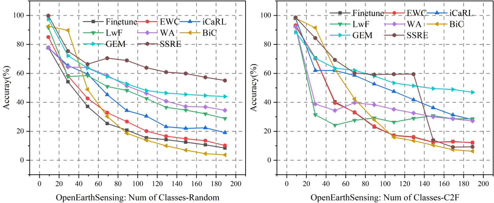

# 📊 Results

## 🌍 Open World Learning

**Table 1.  The experiments of OWL on OpenEarthSensing dataset. ID Acc and ODD Acc are the in-distribution and out-of-distribution performance, respectively, and Avg denotes the average performance of each session.**

| OOD Method   | CIL Method   | ID Acc | OOD Acc | Session 1 | Session 2 | Avg   |  
|--------------|--------------|--------|---------|-----------|-----------|-------|  
| MSP     | LwF     | 91.17  | 55.01   | 91.27     | 42.11     | 66.69 |  
|              | EWC     | 91.17  | 55.01   | 91.27     | 28.89     | 60.08 |  
|              | iCaRL   | 91.17  | 55.01   | 91.27     | 50.29     | 70.78 |  
| MLS     | LwF     | 90.6   | 63.85   | 91.27     | 44.09     | 67.68 |  
|              | EWC     | 90.6   | 63.85   | 91.27     | 29.83     | 60.55 |  
|              | iCaRL   | 90.6   | 63.85   | 91.27     | 51.33     | 71.30 |  
| VIM     | LwF     | 93.5   | 59.99   | 91.27     | 43.49     | 67.38 |  
|              | EWC     | 93.5   | 59.99   | 91.27     | 31.33     | 61.30 |  
|              | iCaRL   | 93.5   | 59.99   | 91.27     | 33.78     | 62.52 |  

### 🌱 Incremental Learning

**Fig 1. Experimental results of CIL. The left figure presents results in randomized order, while the right figure displays systematically organized results arranged from coarse to fine granularity.**

### 🧩 Few-Shot Class-Incremental Learning

**Table 2. The experimental results of few-shot class-incremental learning on the OpenEarthSensing dataset. Shots denote the training samples for each category.**

|          | 50-shot       |          | 10-shot       |          | 5-shot        |          | 1-shot        |          |  
|----------|---------------|----------|---------------|----------|---------------|----------|---------------|----------|  
|          | Last   | Avg      | Last   | Avg      | Last   | Avg      | Last   | Avg      |  
| Alice | 59.54  | 64.66    | 59.17  | 68.64    | 58.82  | 68.35    | 58.94  | 68.4     |  
| FACT  | 46.42  | 49.21    | 46.38  | 49.15    | 46.36  | 49.15    | 46.37  | 49.15    |  
| SAVC  | 71.71  | 79.55    | 72.23  | 80.07    | 66.61  | 75.17    | 59.63  | 76.77    |  

### 🚨 Out-of-Distribution Detection

#### CNN-based Methods

**Table 3. OOD detection performance on OES benchmark. 'Near' represents the average AUROC for Near-OOD datasets, 'Far' indicates the average AUROC for Far-OOD datasets.**

| Method      | Standard       |          | Res Bias      |          | Aerial        |          | MSRGB         |          | IR            |          |  
|-------------|----------------|----------|---------------|----------|---------------|----------|---------------|----------|---------------|----------|  
|             | Near    | Far      | Near    | Far      | Near    | Far      | Near    | Far      | Near    | Far      |  
| MSP     | 88.42   | 93.91    | 66.51   | 78.4     | 54.38   | 56.85    | 65.50   | 66.92    | 61.47   | 65.35    |  
| ODIN    | 87.14   | 95.79    | 67.09   | 75.2     | 52.85   | 57.04    | 66.55   | 61.55    | 62.11   | 73.28    |  
| MDS    | 83.15   | 96.54    | 53.86   | 84.71    | 48.79   | 54.76    | 66.31   | 81.78    | 83.64   | 57.74    |  
| MLS    | 88.59   | 96.12    | 66.44   | 83.17    | 53.93   | 59.78    | 64.46   | 63.37    | 62.49   | 67.06    |  
| VIM    | 90.35   | 98.75    | 60.33   | 83.93    | 50.69   | 59.72    | 64.90   | 81.75    | 57.65   | 51.08    |  
| FBDB   | 90.24   | 98.17    | 66.64   | 87.87    | 54.49   | 60.41    | 59.45   | 74.49    | 61.40   | 68.62    |  
| VOS    | 86.19   | 95.68    | 63.37   | 81.32    | 51.10   | 60.01    | 59.77   | 58.72    | 59.47   | 60.26    |  
| LogiNorm | 89.00   | 95.15    | 68.80   | 80.29    | 53.25   | 56.72    | 77.69   | 55.43    | 64.12   | 63.97    |  
| DML    | 84.38   | 90.36    | 65.78   | 76.16    | 52.89   | 58.60    | 62.56   | 50.68    | 60.39   | 50.56    |  

#### CLIP-based Methods

**Table 4. CLIP based methods' performance on OES benchmark. 'Near' represents the average AUROC for Near-OOD datasets, 'Far' indicates the average AUROC for Far-OOD datasets.**

| Method      | Standard       |          | Res Bias      |          | Aerial        |          | MSRGB         |          | IR            |          |  
|-------------|----------------|----------|---------------|----------|---------------|----------|---------------|----------|---------------|----------|  
|             | Near    | Far      | Near    | Far      | Near    | Far      | Near    | Far      | Near    | Far      |  
| MaxLogits | 53.31   | 43.95    | 68.99   | 63.32    | 64.73   | 40.46    | 68.22   | 9.34     | 62.73   | 37.00    |  
| MCM    | 61.79   | 52.60    | 59.97   | 51.94    | 66.07   | 67.85    | 58.90   | 55.89    | 54.41   | 40.43    |  
| GLMCM  | 62.07   | 52.33    | 59.20   | 51.57    | 65.20   | 67.42    | 57.32   | 56.89    | 51.75   | 42.30    |  
| CoOp   | 86.04   | 94.21    | 64.09   | 73.36    | 61.22   | 76.40    | 66.73   | 90.22    | 61.30   | 45.16    |  
| LoCoOp | 85.71   | 90.94    | 66.20   | 71.67    | 64.18   | 76.52    | 69.64   | 86.28    | 61.41   | 43.33    |  
| SCT    | 85.56   | 90.78    | 65.37   | 70.30    | 64.14   | 77.67    | 68.58   | 86.41    | 60.81   | 42.48    |  
| DPM    | 91.19   | 99.24    | 68.60   | 92.61    | 60.50   | 71.26    | 74.66   | 93.56    | 65.11   | 75.10    |  
